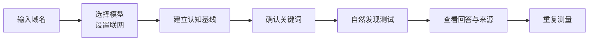

<div align="center">

<picture>
  <source media="(prefers-color-scheme: dark)" srcset="../assets/brand/niubigeo-lockup.svg">
  <source media="(prefers-color-scheme: light)" srcset="../assets/brand/niubigeo-lockup-light.svg">
  
</picture>

# 打破黑盒 GEO，将证据还给用户。

**AI 是否认识你的产品？它如何描述你？没有点名品牌时，谁会出现在答案里？**

NiubiGEO 是开源、可自托管的 AI 品牌可见度与竞争观察工具。<br>
输入一个域名，选择模型，直接查看回答、竞争对象、关键词与引用来源。

[](https://github.com/Albert-Weasker/niubigeo/releases)
[](../LICENSE)
[](deployment/docker.md)
[](https://github.com/Albert-Weasker/niubigeo/stargazers)

**[⚡ 立即部署](#quick-start) · [◉ 查看真实测试](#cases) · [↗ 官方服务](https://niubigeo.ai/) · [✦ AI 顾问](https://video.niubistar.com/niubigeo)**

[English](PRODUCT-GUIDE.md) · [项目主页](https://github.com/Albert-Weasker/niubigeo) · [发布版本](https://github.com/Albert-Weasker/niubigeo/releases)

</div>

---

## 你不缺另一个分数。你缺的是分数背后的回答。

当用户问 AI「有哪些产品可以解决这个问题」「哪一个更适合我」「有哪些替代方案」，你想知道的不是一个孤立的百分比，而是：

- **有没有提到你？** 没有点名品牌时，你的产品是否出现？
- **有没有说对？** 产品定位、能力和使用场景是否准确？
- **还提到了谁？** 哪些产品被放在一起比较？
- **依据是什么？** 回答引用了哪里，哪些描述可以回到原文核查？

NiubiGEO 把问题、模型、联网状态、原始回答与来源放在一起。打开一项结果，就能继续查看它背后的证据。

<div align="center">

**QUESTION → MODEL → ANSWER → SOURCE → EVIDENCE**

**问题 → 模型 → 回答 → 来源 → 证据**

不隐藏问题。保留完整原文。不把一次回答包装成永久排名。

</div>

## 一次运行，看清四件事

<table>
<tr>
<td width="50%" valign="top">
<h3>01 · AI 怎样理解你</h3>
<p>它是否认识这个域名？<br>
认为品牌叫什么、做什么、属于什么类别？<br>
把不同模型的回答放在一起，直接比较。</p>
</td>
<td width="50%" valign="top">
<h3>02 · 谁被放在你身边</h3>
<p>模型提到了哪些竞争对象？<br>
给它们关联了哪些关键词和使用场景？<br>
打开原文，核对它实际说了什么。</p>
</td>
</tr>
<tr>
<td width="50%" valign="top">
<h3>03 · 没点名你时，谁会出现</h3>
<p>用确认后的中性关键词继续测试。<br>
回答出现了你的品牌、其他产品，<br>
还是只解释了一个概念？</p>
</td>
<td width="50%" valign="top">
<h3>04 · 每条结论从哪里来</h3>
<p>查看完整回答、原文位置与来源。<br>
接口引用与正文中的普通 URL 分开记录。<br>
失败和无法确认的结果也能回查。</p>
</td>
</tr>
</table>

> [!IMPORTANT]
> **品牌认知不等于自然发现。** 点名域名后能够识别，不代表用户询问某个品类时，AI 会主动提到或推荐你。NiubiGEO 将这两类测试分开呈现。

<details>
<summary><strong>打开工作台实图：逐模型比较回答与来源</strong></summary>

[](../examples/cases/R04/README.zh-CN.md)

*真实工作台截图，来自 2026-09-08 的 PostHog 公开测试记录。[打开对应回答与来源 →](../examples/cases/R04/README.zh-CN.md)*

</details>

## 证据，不是装饰

| 你需要确认什么 | NiubiGEO 保留什么 |
| :--- | :--- |
| **AI 回答了哪个问题？** | 测试协议、输入域名或关键词 |
| **哪个模型给出了回答？** | Provider、模型标识与运行记录 |
| **当时是否联网？** | 每个模型的联网设置、实际执行信息及无法确认状态 |
| **提到和推荐是一回事吗？** | 原始措辞、提及位置与判断结果 |
| **这个来源是谁返回的？** | Provider Citation 与正文普通 URL 分开记录 |
| **某次运行失败了吗？** | 错误、失败尝试与无法分析的记录 |
| **历史变化来自哪里？** | 每个数据点对应的运行与原始回答 |

<details>
<summary><strong>为什么不只给一个“可见度百分比”？</strong></summary>

百分比需要明确的范围和分母。NiubiGEO 保留模型、关键词、联网状态、测试轮次和可分析结果，让你从汇总回到具体回答，检查变化是从哪里来的。

</details>

<details>
<summary><strong>没有足够证据时会怎样？</strong></summary>

失败、歧义和证据不足会保留为失败或无法确认。你可以检查具体尝试、调整配置并重试，不必把没有成功取得的回答误当成品牌缺席。

</details>

## 从一个域名，到一条可复查的证据链



1. **输入域名。** 为产品创建独立项目。
2. **选择模型。** 搜索 OpenRouter 模型，逐个设置是否联网。
3. **建立基线。** 查看各模型是否认识品牌、如何描述产品，以及提到了哪些竞争对象。
4. **确认关键词。** 选择值得继续观察的中性品类词和使用场景。
5. **运行发现测试。** 不点名目标品牌，查看回答实际出现了谁。
6. **检查证据。** 打开原始回答、来源、原文位置、失败和不确定项。
7. **继续观察。** 使用相同范围重复测量，或创建定时任务积累记录。

<a id="quick-start"></a>

## 现在就运行

### Node.js

准备 **Node.js 22.13+** 和自己的 **OpenRouter API Key**。以下命令安装发布版本 `v0.2.0`：

```bash
git clone --branch v0.2.0 --depth 1 https://github.com/Albert-Weasker/niubigeo.git
cd niubigeo
npm ci
cp .env.example .env
```

在 `.env` 中填写：

```dotenv
OPENROUTER_API_KEY=your_key_here
```

启动工作台：

```bash
npm run server
```

打开 **[http://localhost:8787](http://localhost:8787)**，创建你的第一个项目。

<details>
<summary><strong>使用 Docker 部署</strong></summary>

```bash
git clone --branch v0.2.0 --depth 1 https://github.com/Albert-Weasker/niubigeo.git
cd niubigeo
cp .env.example .env
```

先在 `.env` 中填写 `OPENROUTER_API_KEY`，再启动：

```bash
docker compose up --build -d
```

打开 **[http://localhost:8787](http://localhost:8787)**。工作台和记录使用你自己的部署环境。

[Docker 部署说明](deployment/docker.md) · [备份与升级](upgrade.md)

</details>

> [!TIP]
> 还不想安装？先浏览 [20 组公开测试案例](../examples/README.zh-CN.md)。不需要 Key，就能查看测试条件、模型回答、截图和失败记录。

## 为长期观察而设计

| 你想做什么 | NiubiGEO 如何完成 |
| :--- | :--- |
| **管理多个产品** | 每个域名拥有独立项目、配置、运行记录和证据 |
| **对照多个模型** | 搜索、筛选与选择模型，分别查看结果；单个失败不吞掉其他模型的回答 |
| **逐模型设置联网** | 分别选择离线或支持的 Provider 原生联网方式，保留实际执行条件 |
| **核查品牌认知** | 查看品牌、业务描述、类别、竞争对象和关联关键词 |
| **检查自然发现** | 使用不含目标品牌名的中性关键词，观察实际提及与推荐 |
| **复核每条结论** | 从结果返回完整回答、可核查的原文位置与来源 |
| **追踪后续变化** | 重复运行或定时监测，从历史数据点打开对应证据 |

<details>
<summary><strong>启用定时监测</strong></summary>

在工作台确认项目、模型、关键词与定时任务后，还需要运行独立的监测 Worker。HTTP 服务本身不执行定时扫描。

源码部署：

```bash
npm run schedule:worker -- 60
```

Docker 部署：

```bash
docker compose --profile monitoring up --build -d niubigeo-worker
```

Worker 与工作台应读取同一数据目录。定时执行会产生模型调用费用；先确认任务范围，再启用。

[调度说明](deployment/docker.md#显式启用-worker) · [测量口径](measurement-methodology.md)

</details>

### 你的部署。你的 Key。你的记录。

- **开源：** Community Edition 使用 [Apache-2.0](../LICENSE) 许可证。
- **自托管：** 项目与运行记录保存在你的部署环境中。
- **BYOK：** 使用自己的 OpenRouter API Key，选择要测试的模型。
- **可追溯：** 从结果回到回答、来源和执行条件。
- **回答语言：** 可选择英文或简体中文；`v0.2.0` 部分界面仍为中文，具体语言支持见[版本说明](releases/v0.2.0.md)。

<a id="cases"></a>

## 先看三个真实例子

以下是 2026-09-08 归档的公开产品测试记录，可以直接打开原始回答与截图。

<table>
<tr>
<td width="33%" valign="top">
<h3>Notion</h3>
<p><strong>同一个产品，不同模型看到了什么？</strong></p>
<p>对照品牌描述、竞争对象和关联关键词，查看各模型强调的能力。</p>
<p><a href="../examples/cases/R08/README.zh-CN.md">查看回答 →</a></p>
</td>
<td width="33%" valign="top">
<h3>Figma</h3>
<p><strong>没有点名品牌，回答里出现了谁？</strong></p>
<p>用 Prototyping 测试，区分出现具体产品、解释概念与明确推荐。</p>
<p><a href="../examples/cases/R14/README.zh-CN.md">查看发现测试 →</a></p>
</td>
<td width="33%" valign="top">
<h3>PostHog</h3>
<p><strong>来源与历史变化，能查到哪里？</strong></p>
<p>打开引用、失败与三轮测量记录，其中包含一次定时触发。</p>
<p><a href="../examples/cases/R04/README.zh-CN.md">查看证据 →</a></p>
</td>
</tr>
</table>

这些记录展示品牌认知、发现测试和证据查看；短间隔复测不代表长期增长。

**[浏览全部 20 组测试案例 →](../examples/README.zh-CN.md)**

## 看见问题之后，继续解决问题

开源版可以独立使用。如果希望团队协助测试、核查或改进内容，也可选择官方服务：

| 官方服务 | 你会得到什么 |
| :--- | :--- |
| **AI 可见度诊断** | 模型 API 回答、返回来源、人工事实核查与改进建议 |
| **真人 AI 测试** | 指定地区、语言、平台、网页或 App 下的实际回答、截图与来源 |
| **GEO 内容优化** | 根据诊断修改产品资料，补足缺失信息，并按约定范围复测 |
| **内容与发布** | 自选发布网站，包含免费代写与修改；稿件经你确认后发布，提供文章链接 |

付费报告由团队完成测试与核查；自行使用开源版不需要购买报告。[查看官方服务](https://niubigeo.ai/) · [与 AI 顾问交流](https://video.niubistar.com/niubigeo)

<details>
<summary><strong>Growth Canvas 是什么？</strong></summary>

Growth Canvas 是官方平台的可视化推广画布。输入产品或 GitHub 链接，选择推荐链路或自定义节点，把目标用户招募、产品试用、社区与创作者传播、网站文章发布和 GEO 复测组合为同一份计划，并在工作台查看预算、项目进度与交付。它属于独立的官方平台，不随 Community Edition 安装。

</details>

### NiubiStar × NiubiGEO

[NiubiStar](https://www.niubistar.com/) 支持 NiubiGEO 的开源开发，并为官方服务提供全球真人执行网络与相关推广资源。NiubiGEO 组织测试与交付，让开源测量和真实使用环境中的验证相互补充。使用开源版不要求开通 NiubiStar 账户。

<a id="faq"></a>

## FAQ

<details>
<summary><strong>NiubiGEO 免费吗？</strong></summary>

Community Edition 免费开源。测试自己的项目需要自己的 OpenRouter API Key，并承担模型、搜索服务与服务器费用。阅读仓库里的测试案例不需要 Key。

</details>

<details>
<summary><strong>不开启联网，也能测试吗？</strong></summary>

可以。每个模型可以分别设置不联网或支持的 Provider 原生联网方式。NiubiGEO 保留实际执行条件，不把“请求联网”直接等同于“确认联网成功”。

</details>

<details>
<summary><strong>只有一个模型失败，需要全部重来吗？</strong></summary>

不需要。各模型独立运行，成功结果继续保留；你可以检查失败原因并单独重试。没有成功获得的回答不会自动变成品牌未出现。

</details>

<details>
<summary><strong>为什么 API 结果和网页端不同？</strong></summary>

模型版本、系统指令、搜索能力、地区、账号和界面都可能不同。Community Edition 观察配置的模型 API 回答；需要查看消费者实际使用的网页或 App，可另行安排真人测试。

</details>

<details>
<summary><strong>修改网站后，能立即看到变化吗？</strong></summary>

不一定。公开内容的发现、抓取和使用时间不同，AI 回答也可能波动。保留相同模型、关键词和联网条件重复观察，再检查变化对应的原文和来源。

</details>

<details>
<summary><strong>能测传统搜索排名，或保证 AI 推荐吗？</strong></summary>

当前工具观察 AI 回答，不提供传统搜索引擎排名监测。内容修改与发布也不能保证 AI 收录、引用或推荐。一次回答中的提及、引用与明确推荐分别判断。

</details>

<details>
<summary><strong>如何理解指标、引用和测量边界？</strong></summary>

查看 [测量方法](measurement-methodology.md)、[来源与证据](evidence-model.md)、[能力边界](limitations.md) 与 [已知问题](known-issues.md)。引用能帮助核查回答，但不能单独证明它造成了模型的推荐。

</details>

<a id="learning-resources"></a>

## GEO 原理与学习资料

在 NiubiGEO 官网了解 AI 如何检索与引用内容，以及怎样测试和优化品牌表现。

[资源总览](https://niubigeo.ai/resources) · [GEO 原理](https://niubigeo.ai/resources/principles) · [优化方法](https://niubigeo.ai/resources/methods) · [GEO 术语](https://niubigeo.ai/resources/glossary)

---

<div align="center">

### GEO 不应该是一个无法解释的数字。

**它应该是一条你可以亲自检查的证据链。**

**[⚡ 部署 NiubiGEO](#quick-start) · [◉ 打开测试案例](../examples/README.zh-CN.md) · [↗ 访问官网](https://niubigeo.ai/)**

[GitHub Issues](https://github.com/Albert-Weasker/niubigeo/issues) · [参与开发](../CONTRIBUTING.md) · [support@niubigeo.ai](mailto:support@niubigeo.ai)

<sub>Open source under Apache-2.0 · Built with evidence, not promises.</sub>

</div>
